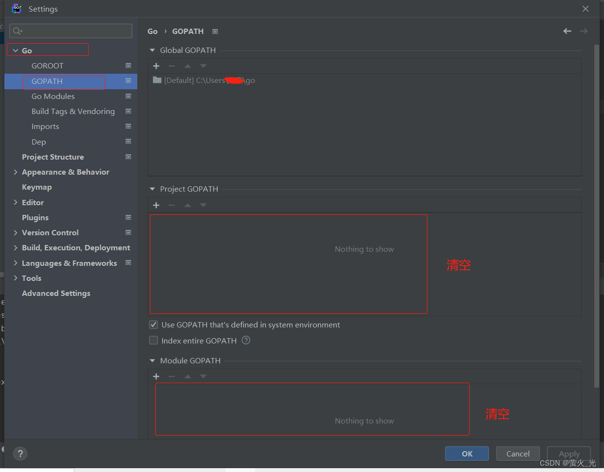

# 1、报错 $GOPATH/go.mod exists but should not
**存在go.mod 的情况，GOPATH不能配置，会冲突**

> **产生原因**：开启模块支持后，并不能与G O P A T H 共 存 , 所 以 把 项 目 从 GOPATH共存,所以把项目从GOPATH共存,所以把项目从GOPATH中移出即可


# 2、依赖无法下载，报错
> A connection attempt failed because the connected party did not properly respond
```shell
# cmd 打开窗口,执行以下命令
go env -w GOPROXY=https://goproxy.io,direct

```